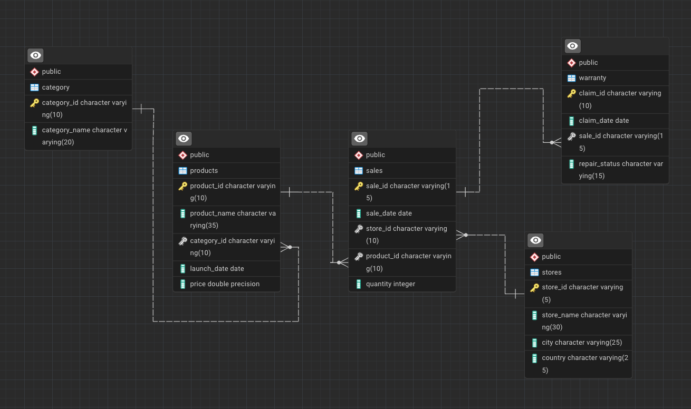

# Apple Retail Sales Analysis Using SQL


## Project Overview

**Database**: `apple_db`

This project is designed to showcase advanced SQL querying techniques through the analysis of over 1 million rows of Apple retail sales data. The dataset includes information about products, stores, sales transactions, and warranty claims across various Apple retail locations globally. By tackling a variety of questions, from basic to complex, I have demonstrated my ability to write sophisticated SQL queries that extract valuable insights from large datasets.

## Entity Relationship Diagram (ERD)



## Database Schema

The project uses five main tables:

1. **stores**: Contains information about Apple retail stores.
   - `store_id`: Unique identifier for each store.
   - `store_name`: Name of the store.
   - `city`: City where the store is located.
   - `country`: Country of the store.

2. **category**: Holds product category information.
   - `category_id`: Unique identifier for each product category.
   - `category_name`: Name of the category.

3. **products**: Details about Apple products.
   - `product_id`: Unique identifier for each product.
   - `product_name`: Name of the product.
   - `category_id`: References the category table.
   - `launch_date`: Date when the product was launched.
   - `price`: Price of the product.

4. **sales**: Stores sales transactions.
   - `sale_id`: Unique identifier for each sale.
   - `sale_date`: Date of the sale.
   - `store_id`: References the store table.
   - `product_id`: References the product table.
   - `quantity`: Number of units sold.

5. **warranty**: Contains information about warranty claims.
   - `claim_id`: Unique identifier for each warranty claim.
   - `claim_date`: Date the claim was made.
   - `sale_id`: References the sales table.
   - `repair_status`: Status of the warranty claim (e.g., Paid Repaired, Warranty Void).
  
## Project Structure

- **Database Creation**: Created a database named `apple_db`.
- **Table Creation**: Created tables for category, products, store, sales and warranty. Each table includes relevant columns and relationships.

```sql
CREATE DATABASE apple_db;

DROP TABLE IF EXISTS [dbo].[category];
CREATE TABLE category (
	category_id		VARCHAR(10)	PRIMARY KEY,
	category_name	VARCHAR(30)
);

DROP TABLE IF EXISTS [dbo].[products];
CREATE TABLE products (
	product_id		VARCHAR(10)	PRIMARY KEY,
	product_name	VARCHAR(50),
	category_id		VARCHAR(10),
	launch_date		DATE,
	price			FLOAT
	CONSTRAINT fk_products_categoryid FOREIGN KEY (category_id) REFERENCES category(category_id)
);

DROP TABLE IF EXISTS [dbo].[stores];
CREATE TABLE stores (
	store_id	VARCHAR(10) PRIMARY KEY,
	store_name	VARCHAR(30),
	city		VARCHAR(25),
	country		VARCHAR(25)
);

DROP TABLE IF EXISTS [dbo].[sales];
CREATE TABLE sales (
	sale_id		VARCHAR(15) PRIMARY KEY,
	sale_date	DATE,
	store_id	VARCHAR(10),
	product_id	VARCHAR(10),
	quantity	INT
	CONSTRAINT fk_sales_storeid FOREIGN KEY (store_id) REFERENCES stores (store_id),
	CONSTRAINT fk_sales_productid FOREIGN KEY (product_id) REFERENCES products (product_id)
);

DROP TABLE IF EXISTS [dbo].[warranty];
CREATE TABLE warranty (
	claim_id		VARCHAR(15) PRIMARY KEY,
	claim_date		DATE,
	sale_id			VARCHAR(15),
	repair_status	VARCHAR(15)
	CONSTRAINT fk_warranty_saleid FOREIGN KEY (sale_id) REFERENCES sales (sale_id)
);
```

## Performance Optimization

Sales Table : product_id 
(cost - 5.03) (0.323s) (Index Scan)
``` sql
SELECT * FROM [dbo].[sales] WHERE product_id = 'P-44';

CREATE NONCLUSTERED INDEX idx_sales_productid ON [dbo].[sales] (product_id);

UPDATE STATISTICS [dbo].[sales];
  ```
(cost - 16.5) (Key Lookup) (Index Seek)
  ``` sql
SELECT * FROM [dbo].[sales] WITH(INDEX(idx_sales_productid))
WHERE product_id = 'P-44';

DROP INDEX idx_idx_sales_productid ON [dbo].[sales];
```

Sales Table : store_id
(cost - 5.03) (0.348s) (Index Scan)
``` sql
SELECT * FROM [dbo].[sales] WHERE store_id = 'ST-31';

CREATE NONCLUSTERED INDEX idx_sales_storeid
ON [dbo].[sales] (store_id);

UPDATE STATISTICS [dbo].[sales];
```
(cost - 17.5) (Key Lookup) (Index Seek)
``` sql
SELECT * FROM [dbo].[sales] WITH(INDEX(idx_sales_storeid))
WHERE store_id = 'ST-31';

DROP INDEX idx_sales_storeid ON [dbo].[sales];
```

Sales Table : sale_date
(cost - 5.03) (0.238s) (Index Scan)
``` sql
SELECT * FROM [dbo].[sales] WHERE sale_date = '2020-06-10';

CREATE NONCLUSTERED INDEX idx_sales_saledate 
ON [dbo].[sales] (sale_date);
```
(cost - 1.87) (Key Lookup) (Index Seek)
Relatively Faster
``` sql
-- DROP INDEX idx_sales_saledate ON [dbo].[sales];
```
Faster Querying (Good to use)

## Objectives

The project is split into three tiers of questions to test SQL skills of increasing complexity:

### Easy to Medium (10 Questions)

1. Find the number of stores in each country.
   ```sql
    SELECT
    	country,
    	COUNT(store_id) AS total_stores
    FROM [dbo].[stores]
    GROUP BY country;  
    ```
2. Calculate the total number of units sold by each store.
   ```sql
   SELECT
    	s.store_id,
    	SUM(quantity) AS total_units
   FROM [dbo].[sales] fs
   RIGHT JOIN [dbo].[stores] s
   ON fs.store_id = s.store_id
   GROUP BY s.store_id;
   ```
3. Identify how many sales occurred in December 2023.
   ```sql
   SELECT
	    COUNT(sale_id) AS total_sales
   FROM [dbo].[sales]
   WHERE sale_date >= '2023-01-01' AND sale_date < '2024-01-01';
    ```
4. Determine how many stores have never had a warranty claim filed.
   ```sql
   SELECT
       COUNT(*)
   FROM [dbo].[stores] s
   WHERE NOT EXISTS (
   SELECT
    	1
   FROM [dbo].[warranty] w
   JOIN [dbo].[sales] fs
   ON w.sale_id = fs.sale_id
   WHERE fs.store_id = s.store_id
   ); 
    ```
5. Calculate the percentage of warranty claims marked as "In Progress".
   ```sql
   SELECT
	    CAST((SELECT COUNT(sale_id)
	          FROM [dbo].[warranty]
	          WHERE repair_status = 'In Progress')*100.0/COUNT(sale_id) AS NUMERIC(10,2)) AS warranty_in_progress_percent
   FROM [dbo].[warranty];
    ```
6. Identify which store had the highest total units sold in the last year.
   ```sql
   SELECT TOP 1
	    s.store_id,
	    s.store_name,
	 SUM(quantity) AS units_sold
   FROM [dbo].[sales] fs
   JOIN [dbo].[stores] s
   ON fs.store_id = s.store_id
   WHERE sale_date >= '2023-01-01' AND sale_date < '2024-01-01'
   GROUP BY s.store_id,s.store_name;
    ```
7. Count the number of unique products sold in the last year.
   ```sql
   SELECT 
	    COUNT(DISTINCT product_id) AS unique_products_sold
   FROM [dbo].[sales]
   WHERE sale_date >= '2023-01-01' AND sale_date < '2024-01-01';
    ```
8. Find the average price of products in each category.
   ```sql
   SELECT
	    c.category_id,
	    c.category_name,
	    ROUND(AVG(price),2) AS avg_product_price
   FROM [dbo].[products] p
   JOIN [dbo].[category] c
   ON p.category_id = c.category_id
   GROUP BY c.category_id,c.category_name;
    ```
9. How many warranty claims were filed in 2020?
   ```sql
   SELECT
	    COUNT(claim_id) AS warranty_claims
   FROM [dbo].[warranty]
   WHERE claim_date >= '2020-01-01' AND claim_date < '2021-01-01';
   ```
10. For each store, identify the best-selling day based on highest quantity sold.
    ```sql
    SELECT
      	store_id,
      	day,
      	total_units
    FROM (
    SELECT
    	store_id,
    	DATENAME(WEEKDAY,sale_date) AS day,
    	SUM(quantity) AS total_units,
    	DENSE_RANK() OVER(PARTITION BY store_id ORDER BY SUM(quantity) DESC) AS ranking
    FROM [dbo].[sales]
    GROUP BY store_id, DATENAME(WEEKDAY,sale_date)
    )t
    WHERE ranking = 1;
    ```

### Medium to Hard (5 Questions)

11. Identify the least selling product in each country for each year based on total units sold.
    ```sql
    SELECT
      	country,
      	yr,
      	product_name,
      	total_units
    FROM (
    SELECT
    	s.country,
    	YEAR(fs.sale_date) AS yr,
    	fs.product_id,
    	SUM(quantity) AS total_units,
    	ROW_NUMBER() OVER(PARTITION BY s.country, YEAR(fs.sale_date) ORDER BY SUM(quantity)) AS ranking
    FROM [dbo].[sales] fs
    JOIN [dbo].[stores] s
    ON fs.store_id = s.store_id
    GROUP BY s.country, YEAR(fs.sale_date), fs.product_id
    )t
    JOIN [dbo].[products] p
    ON t.product_id = p.product_id
    WHERE ranking = 1;
    ```
12. Calculate how many warranty claims were filed within 180 days of a product sale.
    ```sql
    SELECT
	      COUNT(w.claim_id) AS total_claims
    FROM [dbo].[sales] fs
    JOIN [dbo].[warranty] w
    ON w.sale_id = fs.sale_id
    WHERE DATEDIFF(DAY, fs.sale_date, w.claim_date) BETWEEN 0 AND 180;
    ```
13. Determine how many warranty claims were filed for products launched in the last two years.
    ```sql
    SELECT
      	p.product_name,
      	COUNT(w.claim_id) AS total_claims
    FROM [dbo].[sales] fs
    JOIN [dbo].[warranty] w
    ON w.sale_id = fs.sale_id
    JOIN [dbo].[products] p
    ON fs.product_id = p.product_id
    WHERE p.launch_date >= DATEADD(YEAR, -2, GETDATE())
    GROUP BY p.product_name;
    ```
14. List the months in the last three years where sales exceeded 5,000 units in the USA.
    ```sql
    SELECT
      	YEAR(fs.sale_date) AS yr,
      	MONTH(fs.sale_date) AS mth,
      	SUM(quantity) AS total_units
    FROM [dbo].[sales] fs
    JOIN [dbo].[stores] s
    ON fs.store_id = s.store_id
    WHERE s.country = 'United States' AND fs.sale_date >= DATEADD(YEAR,-3,GETDATE())
    GROUP BY YEAR(fs.sale_date), MONTH(fs.sale_date)
    HAVING SUM(quantity) > 5000
    ORDER BY yr,mth;
    ```
15. Identify the product category with the most warranty claims filed in the last two years.
    ```sql
    SELECT TOP 1 WITH TIES
      	c.category_name,
      	COUNT(w.claim_id) AS total_claims
    FROM [dbo].[sales] fs
    JOIN [dbo].[warranty] w
    ON fs.sale_id = w.sale_id
    JOIN [dbo].[products] p
    ON fs.product_id = p.product_id
    JOIN [dbo].[category] c
    ON p.category_id = c.category_id
    WHERE w.claim_date >= DATEADD(YEAR,-2,GETDATE())
    GROUP BY c.category_name
    ORDER BY total_claims DESC;
    ```

### Complex (5 Questions)

16. Determine the percentage chance of receiving warranty claims after each purchase for each country.
    ```sql
    SELECT
      	country,
      	total_purchase,
      	total_units,
      	total_claims,
      	CAST(total_claims * 100.0 / total_purchase AS NUMERIC(10,2)) AS warranty_claim_chance
    FROM (
    SELECT
    	s.country,
    	SUM(fs.quantity) AS total_units,
    	COUNT(w.claim_id) AS total_claims,
    	COUNT(fs.sale_id) AS total_purchase
    FROM [dbo].[sales] fs
    JOIN [dbo].[stores] s
    ON fs.store_id = s.store_id
    LEFT JOIN [dbo].[warranty] w
    ON fs.sale_id = w.sale_id
    GROUP BY s.country
    )t;
    ```
17. Analyze the year-by-year growth ratio for each store.
    ```sql
    WITH store_yearly_sale AS (
  	SELECT
    		s.store_id,
    		s.store_name,
    		YEAR(fs.sale_date) AS yr,
    		SUM(fs.quantity) AS total_units,
    		SUM(fs.quantity * p.price) AS total_sale
  	FROM [dbo].[stores] s
  	LEFT JOIN [dbo].[sales] fs
  	ON s.store_id = fs.store_id
  	JOIN [dbo].[products] p
  	ON fs.product_id = p.product_id
  	GROUP BY s.store_id, s.store_name, YEAR(fs.sale_date)
    ),
    store_growth_ratio AS (
    	SELECT
    		store_name,
    		yr,
    		total_sale AS current_year_sale,
    		LAG(total_sale,1) OVER(PARTITION BY store_id ORDER BY yr ASC) AS prev_year_sale
    	FROM store_yearly_sale
    )
    SELECT
    	store_name,
    	yr,
    	current_year_sale,
    	prev_year_sale,
    	CAST((current_year_sale - prev_year_sale) * 100.0 / prev_year_sale AS NUMERIC (10,2)) AS growth_ratio
    FROM store_growth_ratio
    WHERE prev_year_sale IS NOT NULL;
    ```
18. Calculate the correlation between product price and warranty claims for products sold in the last five years, segmented by price range.
    ```sql
    WITH price_segmentation AS (
    SELECT
    	p.product_id,
    	CASE
    		WHEN p.price < 500 THEN 'Cheap'
    		WHEN p.price <= 1000 THEN 'Mid'
    		ELSE 'Expensive'
    	END AS price_segment,
    	fs.sale_id,
    	w.claim_id
      FROM [dbo].[sales] fs
      JOIN [dbo].[products] p
      ON fs.product_id = p.product_id
      LEFT JOIN [dbo].[warranty] w
      ON fs.sale_id = w.sale_id
      WHERE fs.sale_date >= DATEADD(YEAR,-5,GETDATE())
    )
    SELECT
    	price_segment,
    	COUNT(DISTINCT sale_id) AS total_sales,
    	COUNT(claim_id) AS total_claims,
    	CAST(COUNT(claim_id) * 100.0 / COUNT(DISTINCT sale_id) AS NUMERIC(10,2)) AS claim_rate_pct
    FROM price_segmentation
    GROUP BY price_segment;
    ```
19. Identify the store with the highest percentage of "Paid Repaired" claims relative to total claims filed.
    ```sql
    SELECT TOP 1
    	s.store_id,
    	COUNT(w.claim_id) AS total_claims,
    	SUM(CASE
    			WHEN w.repair_status = 'Completed' THEN 1
    			ELSE 0
    		END) AS completed_claims,
    	CAST( SUM(CASE
    			WHEN w.repair_status = 'Completed' THEN 1
    			ELSE 0
    		END) * 100.0 / 	COUNT(w.claim_id) AS NUMERIC(10,2)) AS completed_claims_pct
    FROM [dbo].[stores] s
    JOIN [dbo].[sales] fs
    ON s.store_id = fs.store_id
    JOIN [dbo].[warranty] w
    ON fs.sale_id = w.sale_id
    GROUP BY s.store_id
    ORDER BY completed_claims_pct DESC;
    ```
20. Write a query to calculate the monthly running total of sales for each store over the past four years and compare trends during this period.
    ```sql
    WITH monthly_sales AS (
    	SELECT
    		s.store_id,
    		DATEFROMPARTS(YEAR(fs.sale_date), MONTH(fs.sale_date), 1) AS sales_month,
    		SUM(fs.quantity * p.price) AS total_sale
    	FROM [dbo].[stores] s
    	JOIN [dbo].[sales] fs
    	ON s.store_id = fs.store_id
    	JOIN [dbo].[products] p
    	ON fs.product_id = p.product_id
    	WHERE fs.sale_date >= DATEADD(YEAR,-4,GETDATE())
    	GROUP BY s.store_id, DATEFROMPARTS(YEAR(fs.sale_date), MONTH(fs.sale_date), 1)
    ),
    sale_monthly_trend AS
    (
    	SELECT
    		store_id,
    		sales_month,
    		total_sale AS current_month_sale,
    		LAG(total_sale) OVER(PARTITION BY store_id ORDER BY sales_month) AS previous_month_sale,
    		SUM(total_sale) OVER(PARTITION BY store_id ORDER BY sales_month) AS running_total
    	FROM monthly_sales
    )
    SELECT
    	*,
    	CAST((current_month_sale - previous_month_sale) * 100.0 / NULLIF(previous_month_sale,0) AS NUMERIC(10,2)) AS sale_growth_pcnt
    FROM sale_monthly_trend;
    ```
    
### Bonus Question

- Analyze product sales trends over time, segmented into key periods: from launch to 6 months, 6-12 months, 12-18 months, and beyond 18 months.
  ```sql
  WITH product_sales AS (
  	SELECT
  		p.product_name,
  		p.launch_date,
  		fs.sale_date,
  		fs.quantity,
  		DATEDIFF(MONTH,p.launch_date,fs.sale_date) AS months_since_launch
  	FROM [dbo].[products] p
  	JOIN [dbo].[sales] fs
  	ON p.product_id = fs.product_id
  	WHERE fs.sale_date > p.launch_date
  ),
  sale_segment AS (
  	SELECT
  		*,
  		CASE
  			WHEN months_since_launch < 6 THEN '0-6'
  			WHEN months_since_launch < 12 THEN '6-12'
  			WHEN months_since_launch < 18 THEN '12-18'
  			ELSE '18+'
  		END AS month_segment
  	FROM product_sales
  )
  SELECT
  	product_name,
  	month_segment,
  	SUM(quantity) AS total_qty_sales
  FROM sale_segment
  GROUP BY product_name, month_segment
  ORDER BY product_name, total_qty_sales DESC;
    ```

## Project Focus

This project primarily focuses on developing and showcasing the following SQL skills:

- **Complex Joins and Aggregations**: Demonstrating the ability to perform complex SQL joins and aggregate data meaningfully.
- **Window Functions**: Using advanced window functions for running totals, growth analysis, and time-based queries.
- **Data Segmentation**: Analyzing data across different time frames to gain insights into product performance.
- **Correlation Analysis**: Applying SQL functions to determine relationships between variables, such as product price and warranty claims.
- **Real-World Problem Solving**: Answering business-related questions that reflect real-world scenarios faced by data analysts.

## Dataset

- **Size**: 1 million+ rows of sales data.
- **Period Covered**: The data spans multiple years, allowing for long-term trend analysis.
- **Geographical Coverage**: Sales data from Apple stores across various countries.

## Conclusion

By completing this project, one will develop advanced SQL querying skills, improve their ability to handle large datasets, and gain practical experience in solving complex data analysis problems that are crucial for business decision-making. This project is an excellent addition to your portfolio and will demonstrate your expertise in SQL to potential employers.

---
